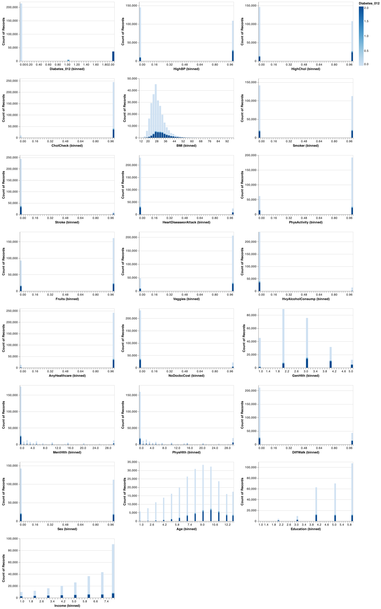
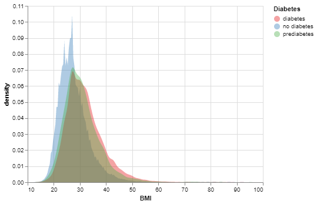
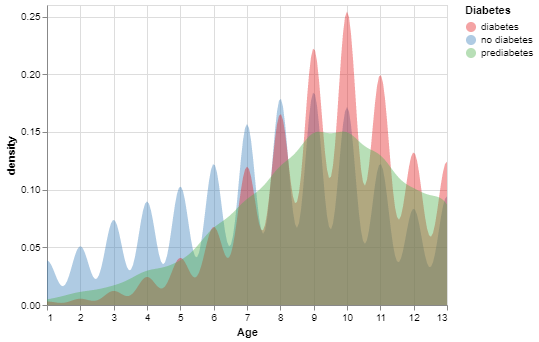
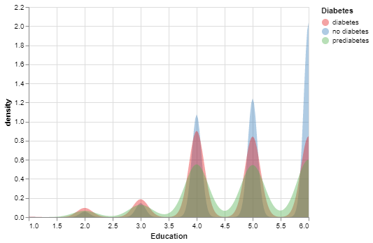
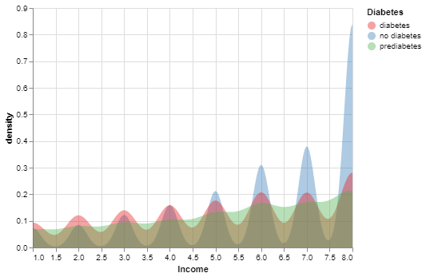

```{r setup, include=FALSE}
knitr::opts_chunk$set(echo = FALSE)
library(tidyverse)
library(knitr)
library(kableExtra)
library(readxl)
```

```{r load results, include = FALSE}
cross_val <- read_csv("../results/cross_val_results.csv")
test_results <- read_csv("../results/final_test_results.csv")
correlation <- read_excel("../results/correlation.xlsx", sheet = "Sheet1")
```

# Project Overview

The prevalence and risk of diabetes is a major health concern to everyone around the world. Various factors, including lifestyle and, diet can facilitate diagnose this disease. With data availability and the improved data analysis techniques, identifying a patient with diabetes is easier. In this report, we will use machine learning technique to identify people with diabetes based on their hearth record. 

# Introduction

Diabetes is a collection of metabolic diseases caused by persistently elevated blood sugar levels. Frequent urination, increased thirst, and increased appetite are common symptoms. Diabetes can lead to a wide range of health issues such as  stroke, foot ulcers, eye damage, nerve damage, and cognitive impairment if neglected. Diabetes is the seventh major cause of death in the world[@2020top]. It can simply double the risk of early death in people[@2022Diabetes]. Diagnose becomes therefore crucial as it will help in adopting a healthy lifestyle which will help avoid its complicated form.

The report of the entire study can be found [here](https://github.com/UBC-MDS/diabetes_prediction/tree/main/src).

# Methods

## Problem Statement and Methodology

The goal of this project is to create 5 machine-learning models and compare their performance in predicting whether a person has diabetes. The best two models will then be used to predict the test data set. The models used are the following (with `DummyRegressor` as the baseline model):

-   Dummy
-   Decision Tree
-   KNN
-   RBF SVM
-   Logistic Regression

## Data

The data set used in this project to predict diabetes is taken from the Center for Disease Control and Prevention (CDC), through the Behavioral Risk Factor Surveillance System (BRFSS) for the year of 2015. This data set is collected annually by the CDC, via a phone survey of over 400,000 Americans on health-related risk behaviours, chronic health conditions, and the use of preventative services. Details of this data set can be found [here](https://www.cdc.gov/brfss/annual_data/annual_2015.html).

## Analysis

To answer the study question: "Given a person's health indicators, can we know if he/she has diabetes or not?". In this case, we are interested in predicting diabetes and not overly concerned with false positives, and this is the reason why we built a model which prioritizes recall scores. To investigate the research question, the data was first split into test and train data sets and performed feature transformation on numeric features. We then build different classification models using `Dummy Classifier`, `Decision Tree Classifier`, `K-Neighbors Classifier`, `SVC` and `Logistic Regression` and cross validated with three scoring metrics, `accuracy`, `f1`, and `recall`, to evaluate these models. After performing cross-validations, the two best models, `SVM` and the `Logistic Regression` were chosen for further hyperparameter tuning due to their high `recall` scores. Finally, we took the best performing two models to conduct predictions of our test set.


*note: for the purpose of this project we will be taking a random sample of 1,000 examples for the analysis due to the immense time and computational power required to run all models on the full data set.*

## The process steps are the following:

1.  Download, clean, and pre-processing the CDC's BRFSS data.
2.  Split data into train and test data sets at a ratio of 8:2
3.  Create and train classifier models.
4.  Cross-validate all models
5.  Hyperparameter optimization of the two best models.
6.  Report the performance results of the models based on their best hyperparameters.
7.  Use best models on test data set and report score.

# Results & Discussion

## EDA

Firstly, let's look at the distributions of the features and target to get a better understanding of the data set. From the distribution of all features, it is immediately apparent that there is a significant class imbalance skewed towards individuals with no diabetes. Considering we are interested in predicting diabetes and not overly concerned with false positives, we need to focus on a model that prioritizes `recall` score. The graph below, illustrates the distribution of all features we have in data:

```{r predictor-distributions, echo=FALSE, fig.cap="Figure 1. Feature Distributions.", out.width = '100%'}

```

The below graphs may help to look deeper:

As it is illustrative in Figure 2, there is significant distinction between the BMI-score distribution of the people with no diabetes and the people who have diabetes or in the pre-diabetes condition.

```{r bmi, echo=FALSE, fig.align = 'center', fig.cap="Figure 2. Comparison of the BMI distribution of people with diabetes, prediabetes, and no diabetes.", out.width = '50%'}

```

The age distribution of these three group of people, shown in figure 3, indicates that the incidence probability of this disease in low-age is low. In other words, the age distribution of people with diabetes is more skewed to left than the age distribution of people with no diabetes. This evidence tells us that the feature of age can be crucial in this study.

```{r age, echo=FALSE, fig.align = 'center', fig.cap="Figure 3. Comparison of the age distribution of people with diabetes, prediabetes, and no diabetes.", out.width = '50%'}

```

The below graph shows that as the education level of people in this study increases it is less likely to have diabetes.

```{r education, echo=FALSE, fig.align = 'center', fig.cap="Figure 4. Comparison of the education distribution of people with diabetes, prediabetes, and no diabetes.", out.width = '50%'}

```

In addition, there seems to be a negative relationship between income level and the incidence of diabetes.

```{r income, echo=FALSE, fig.align = 'center', fig.cap="Figure 5. Comparison of the education distribution of people with diabetes, prediabetes, and no diabetes.", out.width = '50%'}

```

## Results

::: {align="center"}

```{r final results, echo=FALSE}
knitr::kable(test_results, caption = "Table 3. Final Best Model Score on Test Data")
```

From the above table, we can see that the f1 score for the tuned SVC model is `r test_results[[2,3]]` as opposed to `r test_results[[2,6]]` for the tuned Logistic Regression. We mentioned earlier that we are prioritizing the recall scores for this study. The table shows interesting recall scores. The recall score for the SVC model is `r test_results[[2,4]]` as opposed to the recall score of the logistic Regression which is`r test_results[[2,7]]`. The two models have the highest recall scores which limits the false positives in predictions.

## Limits

We understand that our study has limitations. Indeed, a further analysis can be done through incorporating additional features from the BRFSS along with feature engineering and feature selection. Our prediction scores are acceptable but for a deployment stage, we would need to improve them as they are not good enogh for deployment. 

# References
