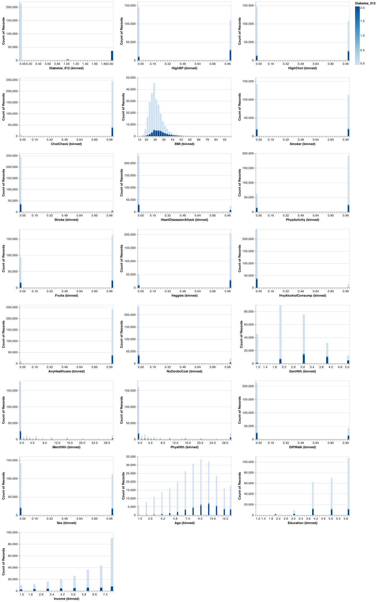

Diabetes Prediction
================
truetruetruetrue
2022/11/23 (updated: 2022-11-30)

- <a href="#project-overview" id="toc-project-overview">Project
  Overview</a>
- <a href="#introduction" id="toc-introduction">Introduction</a>
- <a href="#methods" id="toc-methods">Methods</a>
  - <a href="#problem-statement-and-methodology"
    id="toc-problem-statement-and-methodology">Problem Statement and
    Methodology</a>
  - <a href="#data" id="toc-data">Data</a>
  - <a href="#analysis" id="toc-analysis">Analysis</a>
  - <a href="#the-process-steps-are-the-following"
    id="toc-the-process-steps-are-the-following">The process steps are the
    following:</a>
- <a href="#results--discussion" id="toc-results--discussion">Results
  &amp; Discussion</a>
  - <a href="#eda" id="toc-eda">EDA</a>
  - <a href="#results" id="toc-results">Results</a>
- <a href="#references" id="toc-references">References</a>

# Project Overview

The prevalence and risk of diabetes is a major health concern to
everyone around the world. Various factors, including lifestyle, diet,
and health information can facilitate diagnoses of this disease. Due to
the advancements in data availability, modern data analysis techniques
can be employed to speed up and improve the accuracy of disease
diagnosis. In this report, we discuss our first attempt at predicting
the diagnosis of diabetes, based on standard machine learning methods.
It is worth noting that this project is not an original scientific
research, and its results cannot be practically used or generalized.
This is simply teamwork to cultivate what we have learned in the MDS
program at UBC.

# Introduction

Diabetes is a collection of metabolic diseases caused by persistently
elevated blood sugar levels. Frequent urination, increased thirst, and
increased appetite are common symptoms. Diabetes can lead to a wide
range of health issues if neglected. Cardiovascular disease, stroke,
chronic kidney disease, foot ulcers, eye damage, nerve damage, and
cognitive impairment are examples of serious long-term consequences.
Diabetes is the seventh major cause of death in the world(“The Top 10
Causes of Death” 2020). It can simply double the risk of early death in
people(“Diabetes” 2022). According to the CDC’s National Diabetes
Statistics Report for 2020, 34.2 million people (around 10.5% of the
U.S. population) have diabetes in the United States. Among this amount
of people about 7.3% have not yet been diagnosed (“Home - DRIF,” n.d.).
Diabetes Canada delivers an alarming message regarding a similar
situation in Canada: *“The new diabetes figures show a steady, continued
increase in diabetes in our country with 11.7 million Canadians living
with diabetes or prediabetes”* (“Canada Needs a Nation-Wide Diabetes
Strategy Now,” n.d.).

The EDA and prediction scripts uses the Python Programming language
(Zelle 2004). EDA was conducted using the Pandas package (Bernard 2016)
along with Altair package (Sievert 2018). The machine-learning models
use the Scikit-learn package (Garreta and Moncecchi 2013). The code used
to perform the analysis and create this report can be found
[here](https://github.com/UBC-MDS/diabetes_prediction/tree/main/src).

The R programming language (R Core Team 2022) and the following R
packages were used for this report: knitr (Xie 2014).

The below table shows an estimation prevalence and cost of diabetes in
British Columbia.

| Prevalence                                                                              |             2022             |      2023       |
|:----------------------------------------------------------------------------------------|:----------------------------:|:---------------:|
| Diabetes   (type 1 + type 2 diagnosed + type 2 undiagnosed)                          |        825,000 / 16%         | 1,075,000 / 19% |
| Diabetes   (type 1 and type 2 diagnosed)                                             |        577,000 / 11%         |  753,000 / 13%  |
| Diabetes   (type 1)                                                                  | 5-10% of diabetes prevalence |                 |
| Diabetes   (type 1 + type 2 diagnosed + type 2 undiagnosed) and prediabetes combined |       1,636,000 / 31%        | 1,970,000 / 35% |
| Increase in diabetes (type 1 and type 2 diagnosed) 2022-2032                            |             30%              |                 |
| Direct cost to the health care system                                                   |        \$565 million         |  \$732 million  |

| Out-of-pocket cost per year (2)                      |                 |
|------------------------------------------------------|-----------------|
| Type 1 diabetes on multiple daily insulin injections | \$800–\$2,800   |
| Type 1 diabetes on insulin pump therapy              | \$800–\$4,700   |
| Type 2 diabetes on oral medication                   | \$1,500–\$1,900 |

Table1: Estimated Prevalence and Cost of Diabetes   Sourse: Diabetes
Canada (“Diabetes in British Columbia 2022 Backgrounder,” n.d.)

According to the National Diabetes Statistics Report in 2020, during the
period of 1999-2016 the age-adjusted prevalence of total diabetes have
been increasing among adults 18 years or older. However, there is no
significant changes reported in undiagnosed diabetes prevalence.

| Time Perion | Diagnosed diabetes   percentage (95% CI) | Undiagnosed diabetes   percentage (95% CI) | Total diabetes   percentage (95% CI) |
|:------------|:-------------------------------------------:|:---------------------------------------------:|:---------------------------------------:|
| 1999-2002   |                6.4(5.8-7.0)                 |                 3.1(2.6-3.7)                  |              9.5(8.7-10.4)              |
| 2001-2004   |                7.1(6.5-7.8)                 |                 3.2(2.7-3.8)                  |             10.3(9.4-11.3)              |
| 2003-2006   |                7.4(6.7-8.1)                 |                 2.8(2.2-3.6)                  |             10.2(9.3-11.2)              |
| 2005-2008   |                7.7(6.9-8.5)                 |                 2.9(2.4-3.6)                  |             10.6(9.6-11.6)              |
| 2007-2010   |                7.9(7.1-8.7)                 |                 3.2(2.7-3.7)                  |             11.1(10.1-12.2)             |
| 2009-2012   |                8.1(7.4-8.9)                 |                 3.2(2.6-3.8)                  |             11.3(10.3-12.3)             |
| 2011-2014   |                8.7(8.1-9.4)                 |                 2.7(2.3-3.3)                  |             11.5(10.7-12.3)             |
| 2013-2016   |                9.4(8.6-10.2)                |                 2.6(2.2-3.1)                  |             12.0(11.1-12.9)             |

Table 2: Trends in age-adjusted prevalence of diagnosed, undiagnosed,
and total diabetes among adults aged 18 years or older, United States,
1999-2016   Sourse: Diabetes Canada (Paulose-Ram et al. 2021)

# Methods

## Problem Statement and Methodology

The goal of this project is to create 5 machine-learning models and
compare their performance in predicting whether a person has diabetes.
The best two models will then be used to predict the test data set. The
models used are the following (with `DummyRegressor` as the baseline
model):

- Dummy
- Decision Tree
- KNN
- RBF SVM
- Logistic Regression

## Data

The data set used in this project to predict diabetes is taken from the
Center for Disease Control and Prevention (CDC), through the Behavioral
Risk Factor Surveillance System (BRFSS) for the year of 2015. This data
set is collected annually by the CDC, via a phone survey of over 400,000
Americans on health-related risk behaviours, chronic health conditions,
and the use of preventative services. Details of this data set can be
found [here](https://www.cdc.gov/brfss/annual_data/annual_2015.html).

## Analysis

To answer the study question: “Given a person’s health indicators, can
we know if he/she has diabetes or not?”, we will prioritize `recall` and
`f1` scores in our models to minimize false negatives. The data is first
split into test and train data sets and performed feature transformation
on numeric features. We then build different classification models using
`Dummy Classifier`, `Decision Tree Classifier`,
`K-Neighbors Classifier`, `SVC` and `Logistic Regression` and cross
validated with three scoring metrics, `accuracy`, `f1`, and `recall`, to
evaluate these models. After performing cross-validations, the two best
models, `SVM` and the `Logistic Regression` were chosen for further
hyperparameter tuning due to their high `recall` and `f1` scores.
Finally, we will take the best performing two models to conduct
predictions of our test set.

*note: for the purpose of this project we will be taking a random sample
of 1,000 examples for the analysis due to the immense time and
computational power required to run all models on the full data set.*

## The process steps are the following:

1.  Download, clean, and pre-processing the CDC’s BRFSS data.
2.  Split data into train and test data sets at a ratio of 8:2
3.  Create and train classifier models.
4.  Cross-validate all models
5.  Hyperparameter optimization of the two best models.
6.  Report the performance results of the models based on their best
    hyperparameters.
7.  Use best models on test data set and report score.

# Results & Discussion

## EDA

Firstly, let’s look at the distributions of the features and target to
get a better understanding of the data set. From the distribution of all
features, it is immediately apparent that there is a significant class
imbalance skewed towards individuals with no diabetes. Considering we
are interested in predicting diabetes and not overly concerned with
false positives, we need to focus on a model that prioritizes `recall`
score. The graph below, illustrates the distribution of all features we
have in data:

The below graphs may help to look deeper:

As it is illustrative in Figure 2, there is significant distinction
between the BMI-score distribution of the people with no diabetes and
the people who have diabetes or in the pre-diabetes condition.

The age distribution of these three group of people, shown in figure 3,
indicates that the incidence probability of this disease in low-age is
low. In other words, the age distribution of people with diabetes is
more skewed to left than the age distribution of people with no
diabetes. This evidence tells us that the feature of age can be crucial
in this study.

The below graph shows that as the education level of people in this
study increases it is less likely to have diabetes.

In addition, there seems to be a negative relationship between income
level and the incidence of diabetes.

## Results

<table>
<caption>
Table 3. Final Best Model Score on Test Data
</caption>
<thead>
<tr>
<th style="text-align:right;">
…1
</th>
<th style="text-align:left;">
RBF SVM Tune…2
</th>
<th style="text-align:left;">
RBF SVM Tune…3
</th>
<th style="text-align:left;">
RBF SVM Tune…4
</th>
<th style="text-align:left;">
Logistic Regression Tune…5
</th>
<th style="text-align:left;">
Logistic Regression Tune…6
</th>
<th style="text-align:left;">
Logistic Regression Tune…7
</th>
</tr>
</thead>
<tbody>
<tr>
<td style="text-align:right;">
NA
</td>
<td style="text-align:left;">
Accuracy Score
</td>
<td style="text-align:left;">
f1 Score
</td>
<td style="text-align:left;">
Recall Score
</td>
<td style="text-align:left;">
Accuracy Score
</td>
<td style="text-align:left;">
f1 Score
</td>
<td style="text-align:left;">
Recall Score
</td>
</tr>
<tr>
<td style="text-align:right;">
0
</td>
<td style="text-align:left;">
0.69
</td>
<td style="text-align:left;">
0.38
</td>
<td style="text-align:left;">
0.792
</td>
<td style="text-align:left;">
0.735
</td>
<td style="text-align:left;">
0.391
</td>
<td style="text-align:left;">
0.708
</td>
</tr>
</tbody>
</table>

The f1 score for the tuned SVC model was 0.38 as opposed to 0.391 for
the tuned logistic regression. When it comes to the recall scores, the
SVC score was 0.792 compared to the 0.792 for logistic regression. The
two models have the highest recall scores which limits the false
negatives in predictions.

Further analysis can be done by incorporating additional features from
the BRFSS along with feature engineering and feature selection. Our
prediction scores are by no means good for real life predictions but is
a good starting point and validation that this type of prediction model
can be useful to aid health professionals and high risk individuals to
prevent and minimize the risk of diabetes.

# References

Bernard, Joey. 2016. “Python Data Analysis with Pandas.” In *Python
Recipes Handbook*, 37–48. Springer.

“Canada Needs a Nation-Wide Diabetes Strategy Now.” n.d.
https://www.diabetes.ca/.

“Diabetes.” 2022.
https://www.who.int/news-room/fact-sheets/detail/diabetes.

“Diabetes in British Columbia 2022 Backgrounder.” n.d. www.diabetes.ca.

Garreta, Raul, and Guillermo Moncecchi. 2013. *Learning Scikit-Learn:
Machine Learning in Python*. Packt Publishing Ltd.

“Home - DRIF.” n.d. https://diabetesresearch.org/.

Paulose-Ram, Ryne, Jessica E. Graber, David Woodwell, and Namanjeet
Ahluwalia. 2021. “The National Health and Nutrition Examination Survey
(NHANES), 2021–2022: Adapting Data Collection in a COVID-19
Environment.” *American Journal of Public Health* 111 (12): 2149–56.
<https://doi.org/10.2105/AJPH.2021.306517>.

R Core Team. 2022. *R: A Language and Environment for Statistical
Computing*. Vienna, Austria: R Foundation for Statistical Computing.
<https://www.R-project.org/>.

Sievert, Jacob VanderPlas AND Brian E. Granger AND Jeffrey Heer AND
Dominik Moritz AND Kanit Wongsuphasawat AND Arvind Satyanarayan AND
Eitan Lees AND Ilia Timofeev AND Ben Welsh AND Scott. 2018. “Altair:
Interactive Statistical Visualizations for Python.” *The Journal of Open
Source Software* 3 (32). <http://idl.cs.washington.edu/papers/altair>.

“The Top 10 Causes of Death.” 2020.
https://www.who.int/news-room/fact-sheets/detail/the-top-10-causes-of-death.

Xie, Yihui. 2014. “Knitr: A Comprehensive Tool for Reproducible Research
in R.” In *Implementing Reproducible Computational Research*, edited by
Victoria Stodden, Friedrich Leisch, and Roger D. Peng. Chapman;
Hall/CRC. <http://www.crcpress.com/product/isbn/9781466561595>.

Zelle, John M. 2004. *Python Programming: An Introduction to Computer
Science*. Franklin, Beedle & Associates, Inc.

